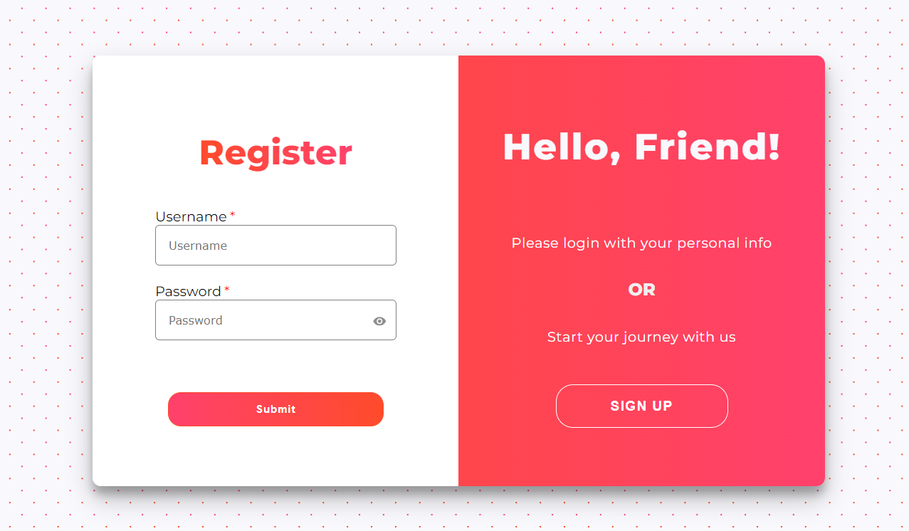

# Project Description

#### This project is a Login Form built using React for the front end and Node.js for the back end.The application allows users to log in with credentials, and it uses a server-side REST API to authenticate the user.

## Features
#### User Authentication: Allows users to log in using their credentials.
#### Front-end: React for the UI, with state management and form validation.
#### Back-end: Node.js and Express for handling API requests.
#### Database: MongoDB for storing user credentials securely.

## Technologies Used

